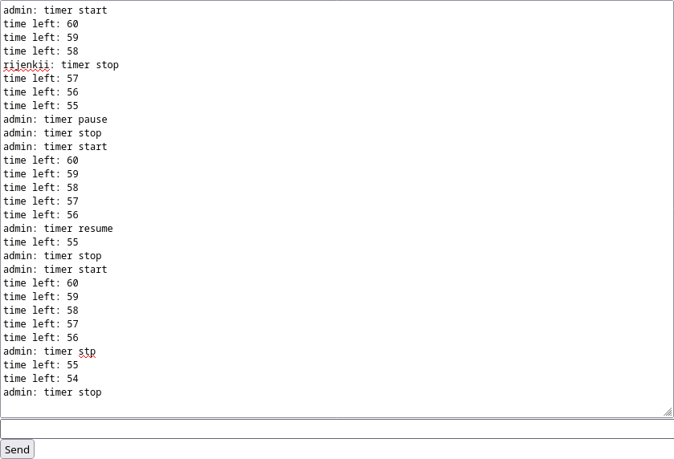

# Таймеры

Веб-интерфейс доступен по адресу `/chat`. Для управления таймером нужно войти в чат с именем пользователя `admin` или `root`. 

Команды управления таймером:

- `timer start`;
- `timer pause`;
- `timer resume`;
- `timer stop`.

Скриншот работы:

## Техническое описание

Основная часть кода находится в файле `chat/consumers.py`.

Таймер состоит из 3х частей:

- Запись в Redis `chat-timer:{room_group_name}:id`, в которой хранится ID текущего таймера;
- Запись в Redis `chat-timer:{room_group_name}:status`, в которой хранится статус текущего таймера;
- Фоновая задача `background_timer`, которой передали `timer_id`, `room_group_name` и `time`.

При запуске таймера создаются описанные записи в Redis и фоновая задача. `...:id` генерируется случайно, `...:status` устанавливается равным `running`.

Фоновая задача раз в секунду проверяет записи в Redis:

- Если запись `...:id` не совпадает с `timer_id`, который был передан задаче при запуске, значит за прошедшую секунду пока таймер "спал" произошла одна из следующих вещей:
    - Таймер остановили;
    - Был запущен другой таймер с другим ID, и для него была создана другая фоновая задача.
  В любом из этих случаев текущая фоновая задача больше не нужна, и она останавливается.
- Если запись `...:status` равна `running`, то задача отправляет всем подключённым клиентам сообщение с текущим временем таймера и "спит" одну секунду.
- Если запись `...:status` равна `paused`, то задача просто "спит" одну секунду (ждёт пока таймер снимут с паузы).

При паузе таймера запись `...:status` устанавливается равной `paused`. При продолжении она устанавливается равной `running`.

При остановке таймера записи в Redis удаляются, и фоновая задача при следующей итерации останавливается.